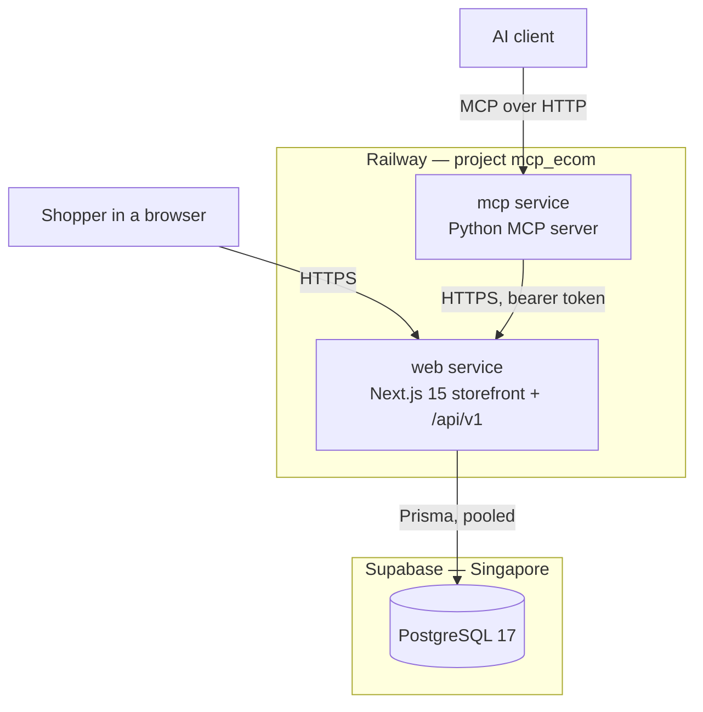

# Technical Snapshot — mcp-ecom

**As of 29 August 2026, milestone M3 complete.**

A complete picture of what this system is, what it is built from, and how
the pieces connect. Every section has a **In plain terms** note, so a
non-technical reader can follow the whole document by reading only those.

> **In plain terms:** This is an online shop, plus a set of instructions
> that lets an AI assistant use that shop on a customer's behalf. This
> document explains how it is built and why.

---

## 1. What exists today

Two separate programs, in two separate repositories, deployed side by side.

| | This repository | The other repository |
|---|---|---|
| Name | `mcp-ecom` | [`mcp-ecom-agent-layer`](https://github.com/arone011-creator/mcp-ecom-agent-layer) |
| What it is | The shop: web pages, business rules, database | The AI-access layer |
| Language | TypeScript (Next.js) | Python |
| Live at | `web-production-bb55d.up.railway.app` | `mcp-production-e344.up.railway.app` |
| Tests | 461 | 108 |

They are connected by one thing only: an HTTP interface called `/api/v1`.
The AI layer never touches the database and never re-implements a rule.

> **In plain terms:** Think of a restaurant. This repository is the
> kitchen — it holds the ingredients and knows all the recipes. The other
> repository is a waiter who can take orders from an AI. The waiter never
> walks into the kitchen and cooks; they pass orders through a hatch. That
> hatch is `/api/v1`.

---

## 2. System map



Everything a shopper does and everything an AI does converges on the same
code path inside `web`. There is no second implementation of "can this
order be cancelled" or "is this in stock".

> **In plain terms:** There is exactly one rulebook, and both the website
> and the AI have to follow it. That is deliberate. If the AI had its own
> copy of the rules, the two copies would drift apart, and eventually the
> AI would allow something the website forbids.

---

## 3. Technology stack

| Layer | Choice | Version |
|---|---|---|
| Framework | Next.js (App Router) | 15.5.6 |
| UI | React + Tailwind CSS + Radix UI | 18.3, 3.4, various |
| Language | TypeScript | 5.9.3 |
| Database access | Prisma ORM | 5.22 |
| Database | PostgreSQL (Supabase) | 17 |
| Authentication | NextAuth | 4.24 (JWT strategy) |
| Validation | Zod | 3.22 |
| Password hashing | bcryptjs | 2.4 |
| Email | Resend + React Email | 3.2 / 0.1 |
| File storage | AWS S3 SDK | 3.5 (configured, unused in the demo) |
| Tests | Jest, Testing Library, jest-axe, Cypress | 29.7 |
| Hosting | Railway (RAILPACK builder) | — |

Notably **absent**: Stripe. Payment processing was removed in M1 — checkout
writes an order row directly and no money moves. The columns
`stripePaymentIntentId` and `stripeSessionId` remain in the database as
harmless leftovers and are deliberately hidden from the API.

> **In plain terms:** These are the off-the-shelf parts the shop is
> assembled from, like listing the brand of engine and gearbox in a car.
> One thing worth knowing: this shop cannot take real payments. Checkout
> creates an order but never charges anyone. It is a demonstration, not a
> live business.

---

## 4. Data model

Fifteen tables. The ones that carry the business:

| Table | Holds |
|---|---|
| `User` | Accounts, hashed passwords, role (`USER` / `ADMIN`) |
| `Product` | Catalogue items, prices, publication status |
| `ProductImage`, `ProductVariant` | Pictures and size/colour options |
| `Inventory` | `quantity`, `reserved`, `available` per product |
| `Cart`, `CartItem` | One cart per user, and the lines in it |
| `Order`, `OrderItem` | Placed orders and a frozen copy of what was bought |
| `Review` | Customer reviews — **attacker-controllable free text** |
| `IdempotencyKey` | Makes retried writes safe (added in M3) |
| `Account`, `Session`, `VerificationToken` | NextAuth's own tables |

Three enums define the state machines: `UserRole`, `ProductStatus`
(`DRAFT`/`PUBLISHED`/`ARCHIVED`), and `OrderStatus` (`PENDING` →
`CONFIRMED` → `PROCESSING` → `SHIPPED` → `DELIVERED`, plus `CANCELLED` and
`REFUNDED`).

Two details that matter more than they look:

- **`available` is not `quantity`.** `quantity` is everything on the shelf;
  `reserved` is what other orders have already claimed; `available` is what
  you can actually sell. Checkout decrements `available`, so that is the
  number that answers "can I buy this".
- **`OrderItem` copies the product name and price** at the time of
  purchase. Changing a product's price later does not rewrite history.

> **In plain terms:** This is the filing system — what information is kept
> and how it is organised. The one worth remembering: "10 in stock" and "10
> available to sell" are different numbers, because some may already be
> promised to other customers.

---

## 5. Identity and authentication

One implementation, used by everyone.

- **Browsers** sign in with email and password. NextAuth issues a session
  cookie containing an encrypted token (a JWE, using AES-256-GCM with a key
  derived from `NEXTAUTH_SECRET`).
- **Programs** — scripts, the MCP server — call `POST /api/v1/auth/token`
  with the same credentials and get back **the same kind of token** as a
  bearer string. Requesting a short life is possible: `ttlSeconds`, clamped
  between 60 seconds and 7 days.
- **Every `/api/v1` route** resolves its caller through one function,
  `requireApiUser` ([session.ts](../apps/web/app/api/v1/_lib/session.ts)).
  A bearer token wins over a cookie, and a bearer token that fails to
  decode is a hard rejection — never a silent downgrade to whatever cookie
  happened to ride along.
- **`GET /api/v1/auth/whoami`** echoes the verified caller. It exists
  because the tokens are *encrypted*, not merely signed, so a non-JavaScript
  program cannot read who it is without re-implementing NextAuth's
  cryptography. Asking is safer than copying.

**The important limitation: these tokens cannot be revoked.** They are
self-contained — the server does not keep a list of valid sessions, so
there is nothing to delete. The only kill switch is rotating
`NEXTAUTH_SECRET`, which signs out every user everywhere. Short lifetimes
are the only real mitigation.

> **In plain terms:** Signing in gets you a pass, like a wristband at a
> festival. Anyone holding the wristband gets in — and there is no way to
> cancel one wristband. If one is lost, the only option is to change the
> design and reissue everybody's. That is why passes given to an AI are set
> to expire in fifteen minutes.

---

## 6. The public API (`/api/v1`)

Nine endpoints. This is the entire surface the AI layer is allowed to use.

| Method | Path | Auth | Purpose |
|---|---|---|---|
| `POST` | `/api/v1/auth/token` | credentials | Exchange email + password for a token |
| `GET` | `/api/v1/auth/whoami` | token | Who am I? |
| `GET` | `/api/v1/products` | none | Search / browse the catalogue |
| `GET` | `/api/v1/products/{id}` | none | One product |
| `GET` | `/api/v1/products/{id}/inventory` | none | Live stock |
| `GET` | `/api/v1/orders` | token | The caller's own orders |
| `GET` | `/api/v1/orders/{id}` | token | One of the caller's orders |
| `POST` | `/api/v1/orders/{id}/cancel` | token | Cancel an order |
| `GET`/`POST`/`DELETE` | `/api/v1/cart` | token | Read, add to, remove from cart |

### Response contract

Every response is one of two shapes, always with `cache-control: no-store`:

```json
{ "data": { ... } }
{ "error": "A human-readable message" }
```

Three conventions the whole system depends on:

1. **Money is a string.** `"10.50"`, never `10.5`. A floating-point number
   loses the trailing zero, and a price without its scale is not a price.
2. **Timestamps are ISO 8601 in UTC.** `"2026-08-29T10:00:00.000Z"`.
3. **Fields are allow-listed, not deny-listed.** `costPrice` (your margin),
   `barcode`, and the leftover Stripe ids never leave the building. A column
   added to the database tomorrow stays private until someone deliberately
   publishes it.

### Deliberate refusals

- Someone else's order returns **404, not 403**. A 403 would confirm the id
  is real, which is all an attacker enumerating ids needs.
- An unpublished product returns **404**, so the API cannot be used to
  discover what is launching next.
- Too many in the cart returns **409** with the number that *is* available —
  the request was fine, the world just cannot satisfy it.
- The password endpoint is rate-limited: 10 attempts per IP and 5 per
  account per 5 minutes, and only *failures* are charged.

> **In plain terms:** This is the hatch between the kitchen and the waiter —
> the complete list of things that can be asked for. Two design habits run
> through it. First, it refuses to confirm that something exists when you
> are not allowed to see it: asking about someone else's order gets "no such
> order", not "not yours", because the second answer tells you the order is
> real. Second, prices are handled as text rather than numbers, so £10.50
> never quietly becomes £10.5.

---

## 7. The storefront

Pages a shopper can reach:

- **Browse** — home, `/products`, `/category/{slug}`, `/search`
- **Product detail** — `/products/{slug}`
- **Cart and checkout** — `/cart`, `/checkout` (creates an order, takes no
  payment)
- **Account** — `/auth/signin`, `/profile`, `/orders`, `/orders/{id}`
- **Admin** — `/admin/products`, `/admin/orders`, `/admin/inventory`,
  gated by role in middleware

Rendering is server-side by default (React Server Components); only pieces
needing interactivity ship JavaScript to the browser. `middleware.ts`
handles route protection, security headers including a Content Security
Policy, and an HTTP→HTTPS upgrade.

> **In plain terms:** The pages a customer actually sees, plus a small admin
> area for whoever runs the shop. Most pages are assembled on the server and
> sent as finished HTML, which makes them fast and works without JavaScript.

---

## 8. Hosting and deployment

| | |
|---|---|
| Platform | Railway, project `mcp_ecom` |
| Service | `web`, root `/apps/web`, builder RAILPACK |
| Region | Singapore (`sin`), 1 replica |
| Deploys from | GitHub `main` — every push builds automatically |
| Build | `prisma generate && next build` |
| Database | Supabase project `mcp_ecom`, PostgreSQL 17, Singapore |

**Database connections** need two URLs, and mixing them up breaks things in
confusing ways:

- `DATABASE_URL` → the **transaction pooler** (port 6543,
  `?pgbouncer=true`) for normal queries
- `DIRECT_URL` → the **session pooler** (port 5432) for migrations

Migrations are **not** run automatically by the build. They are applied
deliberately with `npx prisma migrate deploy`.

Two traps already paid for:

- **A `Dockerfile` at the service root silently switches Railway's builder**
  from RAILPACK to Docker. Moving one file caused a failed production build
  in M2. It now lives in `apps/web/docker/`, out of auto-detection range,
  with a test guarding its location.
- **Railway's private network breaks the HTTPS upgrade.** Internal traffic
  has no proxy setting `x-forwarded-proto`, so the middleware redirects it
  to an address with no TLS. The MCP server therefore talks to the
  storefront over its public domain.

> **In plain terms:** The code lives on GitHub. Pushing to the main branch
> automatically builds and publishes it. The database is hosted separately
> by Supabase, in Singapore, close to the servers. Database structure
> changes are applied by hand on purpose, so nobody's data is reshaped by
> an accidental push.

---

## 9. Testing and the scorecard

461 tests across four suites: 17 unit files, 15 integration files, 1
accessibility suite (jest-axe), 3 Cypress end-to-end specs.

**The integration tests mock the database entirely.** They test routing,
permissions and response shapes — not SQL. Real verification has always
been live checks against the deployed site, and that habit has paid off
four times: a price type mismatch, a cache leaking one user's orders, a
missing session header, and a broken private network — none of which any
green test suite noticed.

### The scorecard

`npm run scorecard -- <milestone> --gate` records tests, coverage, type
errors, build size and live latency into
[metrics/scorecard.json](../apps/web/metrics/scorecard.json), and **exits
non-zero if any metric got worse**. A milestone cannot be closed on a
regression unless it is written down as accepted, with a reason.

| Milestone | Tests | Statement coverage |
|---|---|---|
| m0-upstream | 167 | 70.89% |
| m1-gate1-auth-and-search | 193 | 60.00% |
| m1-gate2-checkout-flow | 219 | 68.78% |
| m1-deployed | 227 | 68.78% |
| m1-singapore | 245 | 67.48% |
| m2-api | 405 | 73.36% |
| **m3-mcp** | **461** | **75.09%** |

Coverage records absolute covered/total counts alongside percentages,
because a percentage alone cannot tell "we covered less" apart from "we
started measuring more code" — a distinction that produced a false alarm in
M1.

> **In plain terms:** Every change is checked automatically. On top of that,
> each major milestone takes a snapshot of the project's health — how many
> tests, how much of the code they cover, how fast the site is — and the
> project refuses to move on if any of those numbers got worse without an
> explanation. It is a ratchet: things are allowed to improve, not to
> quietly rot.

---

## 10. Configuration

| Variable | Required | Purpose |
|---|---|---|
| `DATABASE_URL` | yes | Pooled Postgres connection |
| `DIRECT_URL` | yes | Direct connection, for migrations |
| `NEXTAUTH_SECRET` | yes | Signs and encrypts session tokens |
| `NEXTAUTH_URL` | yes | Canonical site URL |
| `NEXT_PUBLIC_APP_URL`, `NEXT_PUBLIC_APP_NAME` | yes | Public branding |
| `ADMIN_EMAIL`, `ADMIN_PASSWORD` | seeding only | Creates the admin account |
| `RESEND_API_KEY`, `FROM_EMAIL` | optional | Transactional email |

Note: `.env.example` still lists `STRIPE_*` variables. They are stale —
Stripe was removed in M1 and nothing reads them.

Prisma's CLI reads `.env`, **not** `.env.local`. Source the file explicitly
when running migrations.

> **In plain terms:** The settings the app needs to run — database address,
> the secret that secures logins, and so on. These are never stored in the
> code; they are set per environment, so the live site and a developer's
> laptop can point at different databases.

---

## 11. Integrations

| Integration | Direction | What flows |
|---|---|---|
| **Supabase** | outbound | All data, via Prisma over a connection pool |
| **Railway** | hosting | Builds from GitHub, injects `PORT`, terminates TLS |
| **GitHub** | source | `main` is the deploy branch |
| **mcp-ecom-agent-layer** | inbound | Calls `/api/v1` with a bearer token |
| **Resend** | outbound | Order emails (configured, optional) |
| **AWS S3** | outbound | Image uploads (configured, unused in the demo) |

The agent layer is a **consumer, not a component**. It has no credentials
beyond a user's own token, no database access, and no special privileges.
If it were switched off tomorrow, the shop would not notice.

> **In plain terms:** The outside services this depends on. The key point is
> the AI layer is just another customer of the shop's API — it has no
> backstage pass. Turning it off breaks nothing.

---

## 12. Known limitations

Honest, not exhaustive. Each of these is a real gap, written down so nobody
discovers it the hard way.

- **This is a demo.** No payments, no returns subsystem, no fraud checks.
- **Tokens cannot be revoked** (see §5).
- **Rate limiting is per-instance and in memory.** One replica today, so the
  limits mean what they say. Scale to two and the effective allowance
  doubles.
- **Tests do not exercise a real database.** They mock Prisma wholesale.
- **`sort=price` is always descending.** Ascending is unreachable through
  the API, so "cheapest first" cannot be answered.
- **Review text is attacker-controllable** and flows into AI context through
  the agent layer. This is an unmitigated prompt-injection vector and needs
  a design pass before the AI layer goes past demo scope.
- **83 npm advisories, 4 critical**, inherited from the upstream project.
- **`.env.example` is stale** — it advertises Stripe variables that nothing
  reads.

> **In plain terms:** What this is not, and what would need fixing before
> real customers and real money. The most important one: product reviews are
> written by strangers, and the AI reads them. A carefully worded review
> could try to give the AI instructions. Nothing currently stops that, and
> it must be solved before the AI layer is used for real.

---

## 13. Running it locally

```bash
cd apps/web
npm install
cp .env.example .env.local     # then fill in the values
npx prisma migrate deploy
npm run db:seed
npm run dev
```

Useful commands:

| Command | Does |
|---|---|
| `npm test` | The full suite |
| `npm run type-check` | TypeScript, no emit |
| `npm run scorecard -- <name>` | Capture a milestone snapshot |
| `npm run admin:password` | Rotate the admin credential |
| `npm run db:studio` | Browse the database in a GUI |

> **In plain terms:** The steps to get a copy running on your own computer.
> You need Node.js and access to a database.

---

## 14. Where to read next

| Document | Covers |
|---|---|
| [docs/mcp/README.md](mcp/README.md) | The AI layer: phases, status, design record |
| [docs/mcp/tool-surface.md](mcp/tool-surface.md) | The nine AI capabilities and their risk tiers |
| [docs/mcp/open-questions.md](mcp/open-questions.md) | Every known risk, each assigned an owner |
| [docs/DOCS_INDEX.md](DOCS_INDEX.md) | Everything else |
| [docs/superpowers/plans/](superpowers/plans/) | The task-level plans, kept as a record |

> **In plain terms:** Where to look for more detail on any part of this.
